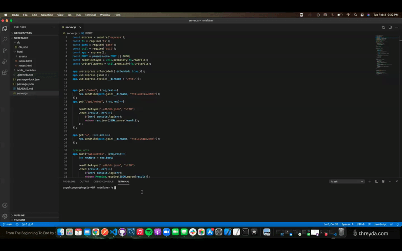

# Note Taker
 Below shows an example of running "node server.js". The server will be listening ubder the port of 8080

 

Now the second gif shows an example of the application being run, after running the server. In the web browser go to "localhost:8080". 

Then click "Get Started". Next the page will go to the note taker page, where notes can be made and stored. 

